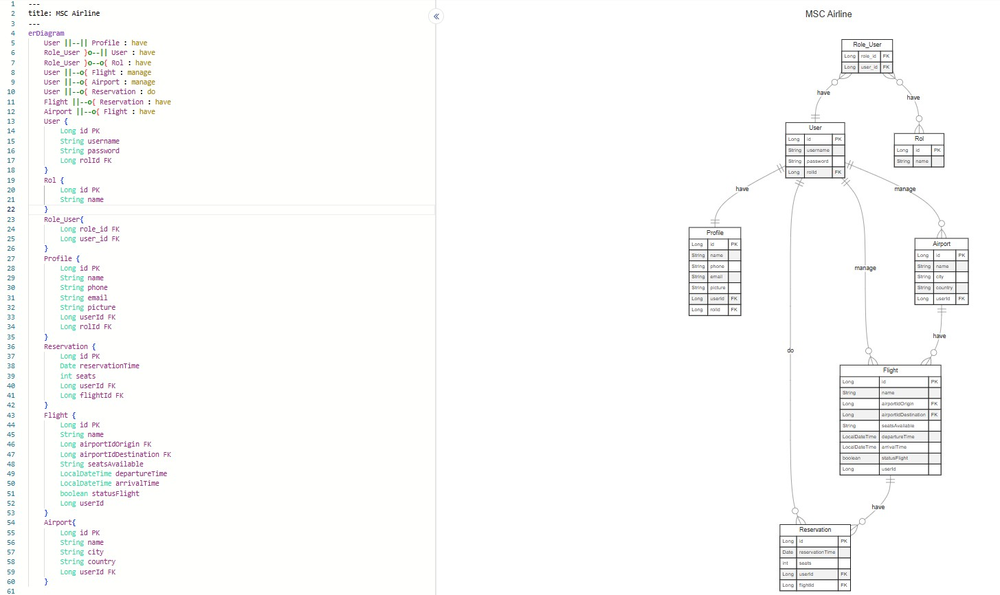
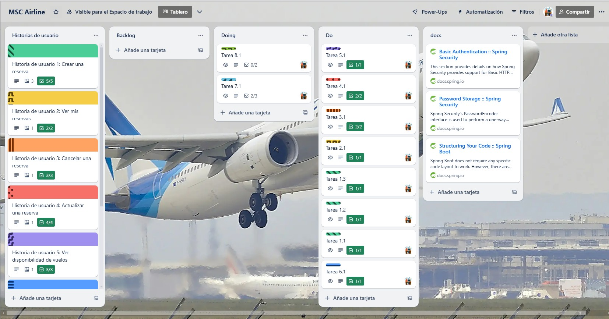

# **MSC Airline** 🏢  🛫🛬

---

---

## 📝 **Introduction**
Welcome to the MSC Airline project! This is a Spring Boot backend application designed to manage **airports**, **flights**, **reservations**, **users**, and user **profiles** through CRUD operations. The system allows you to manage flight details, make reservations, track seat availability, and interact with user profiles. This application can be used as a part of a larger airline management system.

---
## 🎯 **Project objectives:**

- **Available flights** ✈️ – Manage and track available flights, including their status.
- **Flight Status** 🛫🛬: Track the flight status to see if seats are available.
- **Passenger Management** 🛄: Manage reservations made by passengers, including seat assignments, reservation updates, and cancellations.
- **Airports** 🏢: Track airports, their locations, and flights departing or arriving at each airport.

---

## 📦 **Features**

### **Airports**

- Add, update, delete, and view airports.
- View details of airports like name, location, and flights associated with each airport.

### **Flights**

- Add, update, and view flight information.
- Track available seats for flights and update availability based on reservations.

### **Reservations**

- Create, update, and cancel reservations.
- Reserve seats for passengers on flights.
- Manage reservation status and seat availability.

### **Users**

- Manage user profiles, including user roles (admin, passenger).
- Authenticate and authorize users to access different endpoints based on roles.

---

## 📦 **erDiagram**

---

## 📦 **UML Diagram**

---

## 📊 **Broad**

---

## 🗂️  **Files Structure**

    |--- .idea
    |--- src
        |--- main
            |--- java
                |---org.msc.mscAirline
                        |--- airports
                            |--- Airport
                            |--- AirportController
                            |--- AirportMapper
                            |--- AirportRepository
                            |--- AirportRequest
                            |--- AirportResponse
                            |--- AirportService
                        |--- authentication
                            |--- AuthenticationController
                        |--- config
                            |--- SecurityConfiguration
                        |--- exceptions
                            |--- AirlineAlreadyExistsException
                            |--- AirlinetNotFoundException
                            |--- GlobalExceptionHandler
                        |--- flights
                            |--- Flights
                            |--- FlightsController
                            |--- FlightsMapper
                            |--- FlightsRepository
                            |--- FlightsRequest
                            |--- FlightsResponse
                            |--- FlightsService
                            |--- FlightsValidationException
                        |--- home
                            |--- HomeController
                        |--- profiles
                            |--- Profile
                            |--- ProfileController
                            |--- ProfileMapper
                            |--- ProfileRepository
                            |--- ProfileRequest
                            |--- ProfileResponse
                            |--- ProfileService
                        |--- register
                            |--- RegisterController
                            |--- RegisterService
                        |--- reservations
                            |--- Reservations
                            |--- ReservationsController
                            |--- ReservationsMapper
                            |--- ReservationsRepository
                            |--- ReservationsRequest
                            |--- ReservationsResponse
                            |--- ReservationsService
                            |--- ReservationsValidationException
                        |--- roles
                            |--- Role
                            |--- RoleRepository
                            |--- RoleService
                        |--- security
                            |--- JpaUserDetailService
                            |--- SecurityUser
                        |--- users
                            |--- User
                            |--- UserController
                            |--- UserMapper
                            |--- UserRepository
                            |--- UserRequest
                            |--- UserResponse
                            |--- UserService
                        |--- MscAirlineApplication
            |--- resources
                |--- META-INF
                    |--- additional-spring-configuration-metadata.json
                |--- application.properties
                |--- application-dev.properties
                |--- application-test.properties
                |--- dataH2.sql
                |--- dataPostgres.sql
        |--- test
           |--- java
               |---org.msc.mscAirline
                        |--- airports
                            |--- AirportServiceTest
                        |--- MscAirlineApplicationTests

---

## 💻 Technology Stack:

 
 
  
 

 
 

 
 

---

## 🚀 **Getting Started**

### **Prerequisites**

1. **Java 21** or higher.
2. **MySQL** installed and running.
3. A code editor (e.g., **VS Code**, **IntelliJ IDEA**, etc.).

### **Clone the repository**

To get started with the project, first clone the repository:

bash
git clone https://github.com/monicasimoF5/mscAirline.git
cd msc-airline

---

## ⚙️ **Endpoints Overview**

### **Registers**
- **POST /api/v1/register**: Create a new register.

### **Users**
- **POST /api/v1/users**: Create a new user.
- **GET /api/v1/users/**: Get all user details.
- **GET /api/v1/users/{id}**: Get user details by ID.
- **PUT /api/v1/users/{id}**: Update user details.
- **DELETE /api/v1/users/{id}**: Delete a user.

### **Profiles**
- **GET /api/v1/profiles**: Get all profile details.
- **GET /api/v1/profiles/{id}**: Get profile details by ID.
- **GET /api/v1/profiles/{email}**: Get profile details by email.
- **PUT /api/v1/profiles/{id}**: Update profile details.

### **Flights**
- **POST /api/v1/flights**: Create a new flight.
- **GET /api/v1/flights**: Get all available flights.
- **GET /api/v1/flights/{id}**: Get flight details by ID.
- **PUT /api/v1/flights/{id}**: Update flight information.
- **DELETE /api/v1/flights/{id}**: Delete a flight.

### **Reservations**
- **POST /api/v1/reservations**: Create a new reservation.
- **GET /api/v1/reservations**: Get all reservations.
- **GET /api/v1/reservations/{id}**: Get reservation details by ID.
- **PUT /api/v1/reservations/{id}**: Update a reservation.
- **DELETE /api/v1/reservations/{id}**: Delete a reservation.

### **Airports**
- **POST /api/v1/airports**: Add a new airport.
- **GET /api/v1/airports**: Get all airports.
- **GET /api/v1/airports/{id}**: Get airport details by ID.
- **GET /api/v1/airports/{name}**: Get airport details by NAME.
- **PUT /api/v1/airports/{id}**: Update airport information.
- **DELETE /api/v1/airports/{id}**: Delete an airport.

---

## 🌐 Author

### **Mònica Simó**
  

